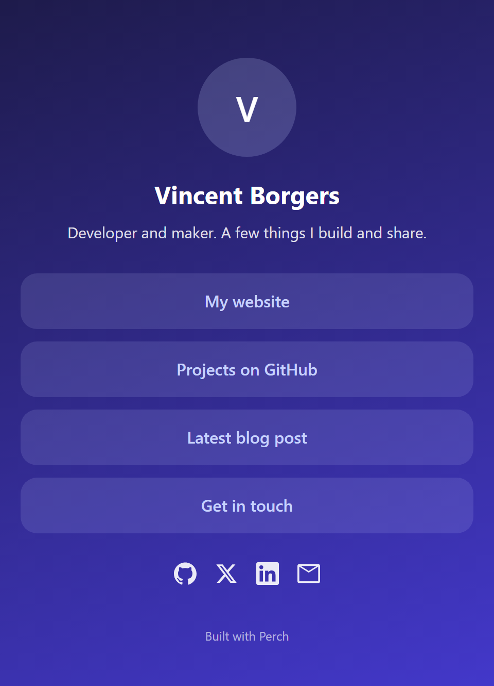

<h1 align="center">Perch</h1>

<p align="center">
  A self hosted link in bio page. One page with your links, in your own style, on your own server.
</p>

<p align="center">
  <a href="#license"></a>
  
  
  <a href="https://buymeacoffee.com/vincentborgers"></a>
</p>

<p align="center">
  No accounts, no tracking, no third party services. You own the data.
</p>

<p align="center">
  
</p>

---

## Features

- One clean page with your avatar, name, short bio and a list of links
- Admin panel that edits everything with a live preview
- Themes: background as a solid color, gradient or image, plus button styles, colors, fonts and rounded corners
- Social icon row: Instagram, X, YouTube, TikTok, LinkedIn, GitHub, email and website
- All content stored in a single JSON file, easy to back up and move
- Password protected admin, signed session cookie, basic login rate limiting

## Requirements

- Node.js 18.18 or newer
- npm

## Quick start

```bash
git clone https://github.com/VincentBorgers/perch.git
cd perch
npm install
npm run setup yourStrongPassword
npm run dev
```

Open http://localhost:3000 for the public page and http://localhost:3000/admin to log in and edit.

## Setup

The setup script writes your password as a bcrypt hash to the data file and adds a session secret to `.env`.

```bash
npm run setup yourStrongPassword
```

You can also pass the password through an environment variable:

```bash
ADMIN_PASSWORD=yourStrongPassword npm run setup
```

## Build and run in production

```bash
npm run build
npm start
```

The app listens on port 3000 by default. Set `PORT` to change it.

## Configuration

Environment variables, see `.env.example`:

| Variable          | Description                                                       |
| ----------------- | ---------------------------------------------------------------- |
| `SESSION_SECRET`  | Random string used to sign the admin session cookie. Created by the setup script if missing. |
| `PERCH_DATA_DIR`  | Optional path to the folder that holds `db.json`. Defaults to `./data`. |
| `PORT`            | Optional port for `npm start`. Defaults to `3000`.               |

## Data and backups

All content lives in one file at `data/db.json`. Copy that file to back up your page. Move it to another server to migrate. The `data` folder is ignored by git, so your content and password hash are never committed.

## Security

- The admin password is stored as a bcrypt hash, never in plain text.
- The session cookie is http only, same site strict and signed with `SESSION_SECRET`.
- Login has basic rate limiting per IP address.
- Link and social URLs are limited to http, https and mailto before they are rendered.
- Run behind HTTPS in production so the secure cookie flag takes effect. A reverse proxy such as Caddy or Nginx works well for this.

## Project layout

```text
src/
  app/            pages and API routes
  components/     the public page view and icons
  lib/            storage, auth, session and validation
scripts/
  setup.mjs       sets the admin password and session secret
```

## Rename and rebrand

The name `Perch` is just a default. To use your own name, search the project for `Perch` and replace it, and edit the footer in `src/components/BioView.tsx`.

## Disclaimer

This is a personal, non commercial open source project, made and shared in my
free time. It is not a product or a service, and it comes with no support or
guarantee, even though the contact address uses a domain name.

Perch is provided as is, without any warranty. You use it at your own risk. You
are responsible for running it safely, for keeping your own backups, and for the
content you publish with it. The author is not liable for any damage that results
from using it. See the LICENSE file for the full terms.

## Support

If Perch is useful to you, you can support the work here:

<a href="https://buymeacoffee.com/vincentborgers">
  
</a>

## License

MIT, copyright (c) 2026 Vincent Borgers. See [LICENSE](LICENSE).
